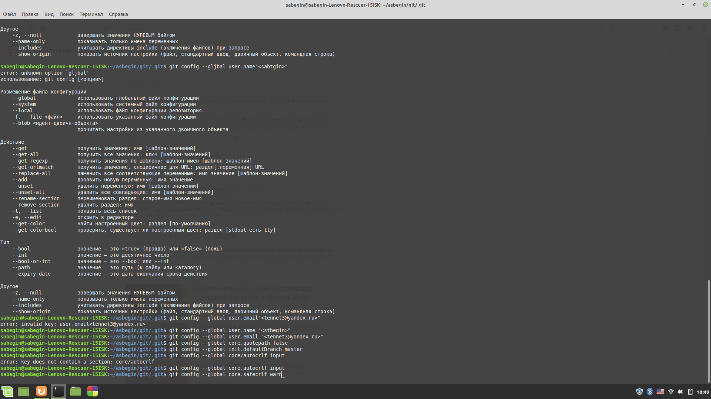
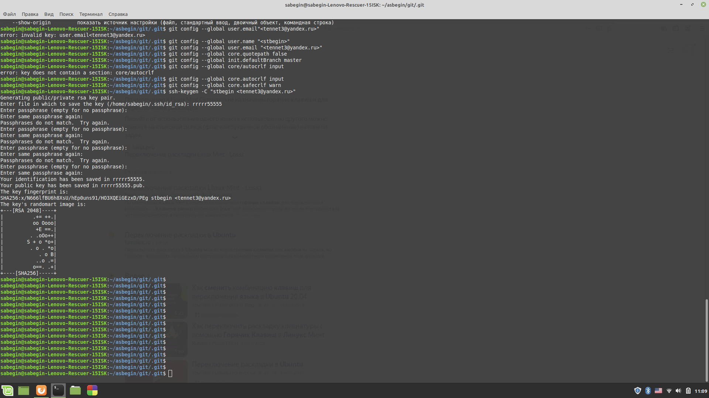
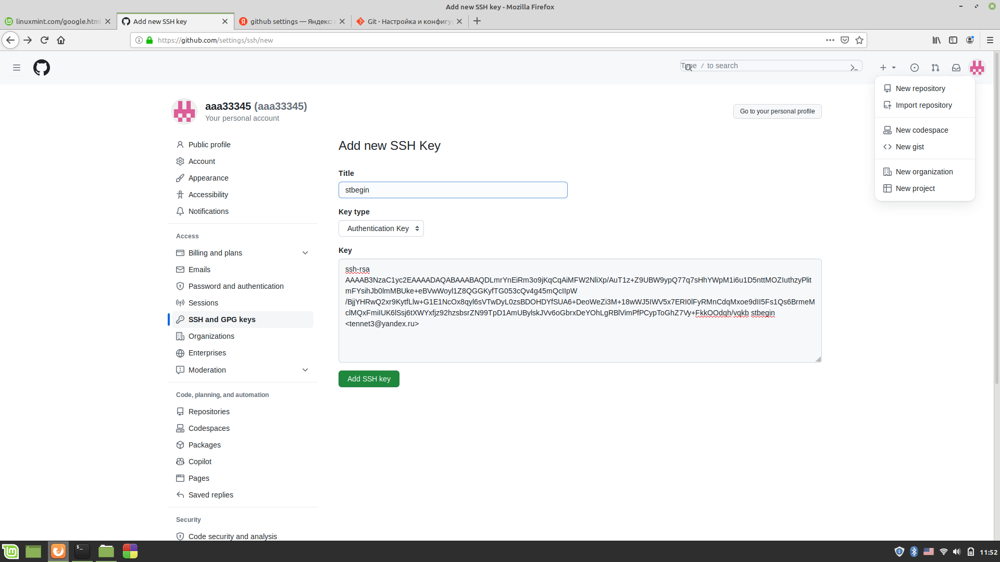
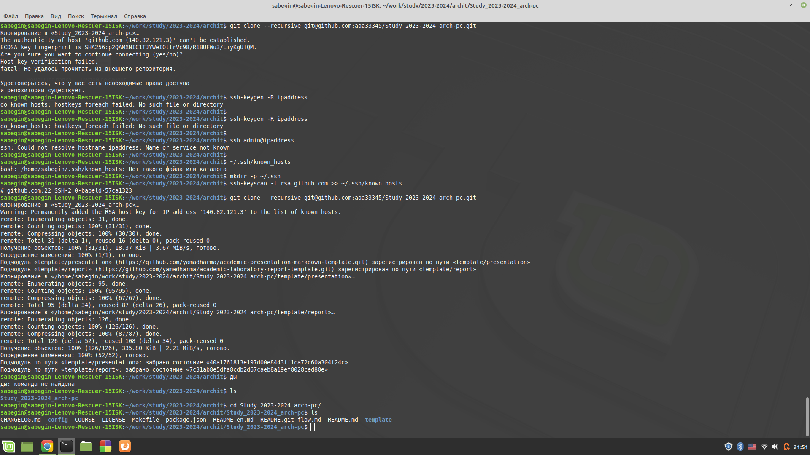
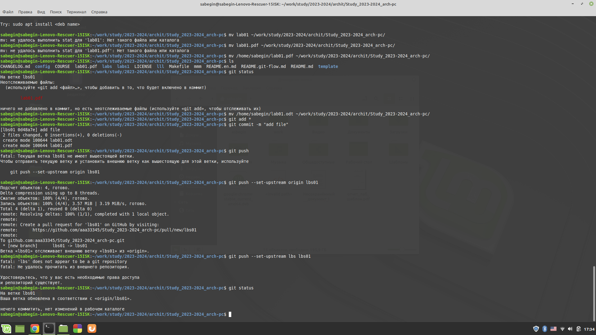
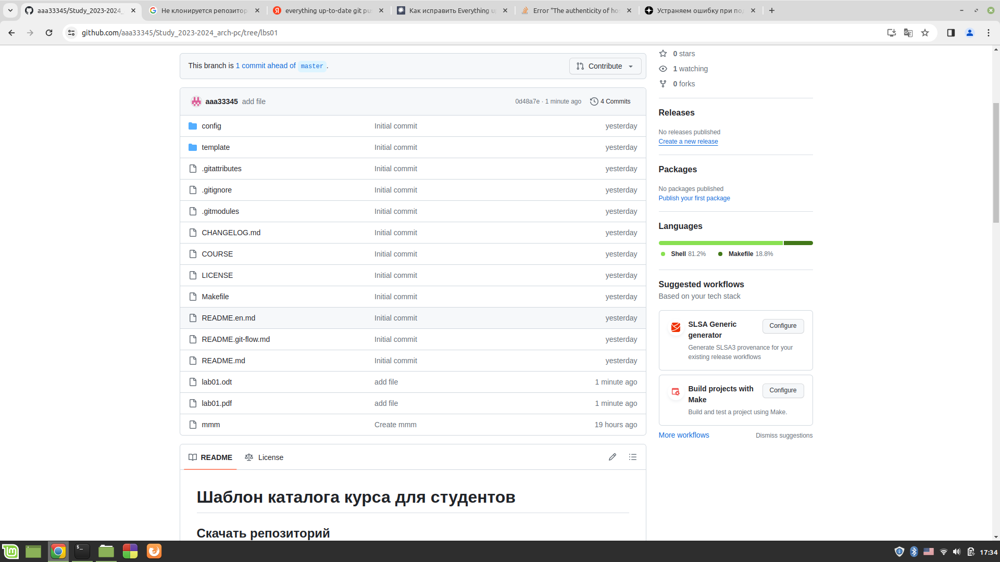

# РОССИЙСКИЙ УНИВЕРСИТЕТ ДРУЖБЫ НАРОДОВ 
## Кафедра прикладной информатики и теории вероятностей
## Факультет физико-математических и естественных наук
## Кафедра прикладной информатики и теории вероятностей
## ЛАБОРАТОРНАЯ РАБОТА No 2
## дисциплина:Архитектура компьютера
## Студент:Бегин Станислав Александрович
## Группа:НПИбд-01-23
## МОСКВА
## 2024 г.

### Цель лабароторной работы:
Научится на базовом уровне работать с git и загружать изменения в нем в гитхаб

Описание работы:

{#fig:fig1 width=100%}

{#fig:fig1 width=100%}

{#fig:fig1 width=100%}

{#fig:fig1 width=100%}

{#fig:fig1 width=100%}

### Выводы

Научился на базовом уровне работать с git 

### Cамостоятельная работаамостоятельная работа  

{#fig:fig1 width=100%}

### Вывод
Научился сохранять файлы в дериктории и отправлять их в гитхаб

