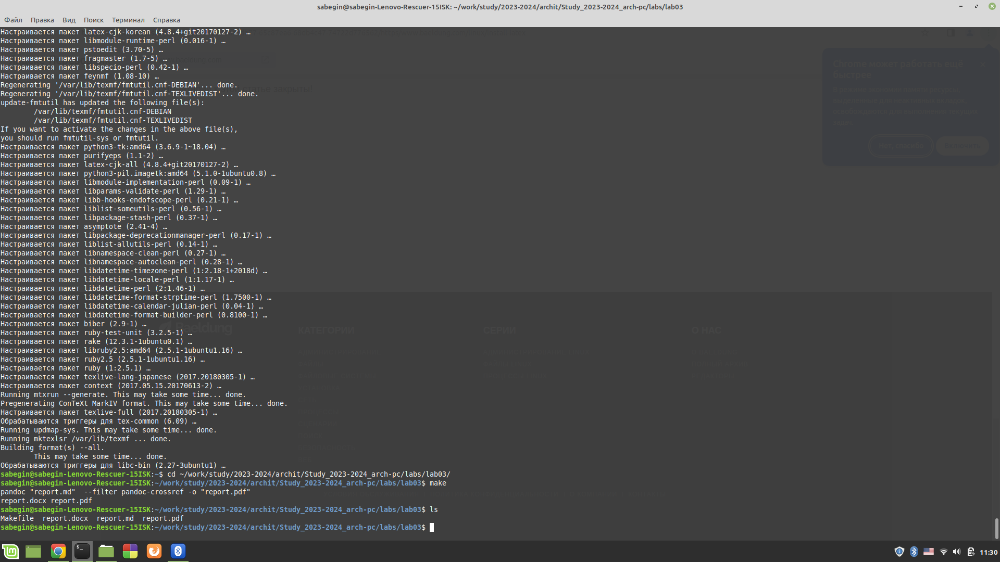
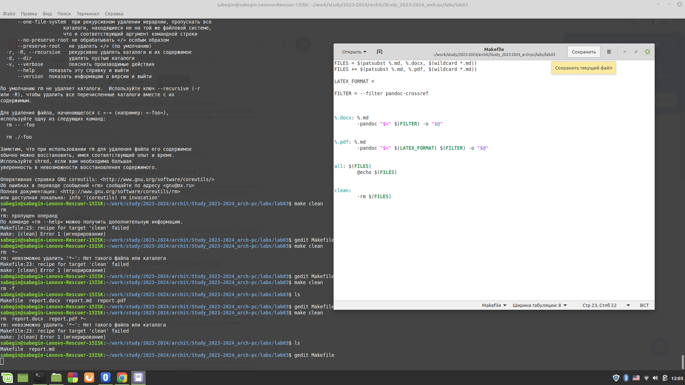
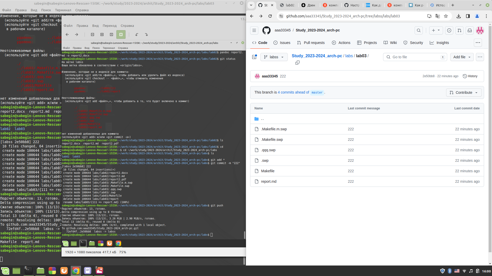
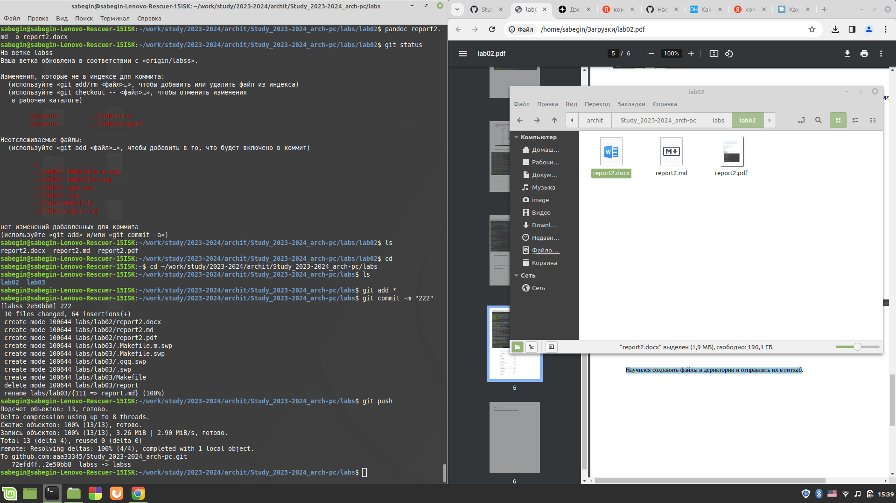
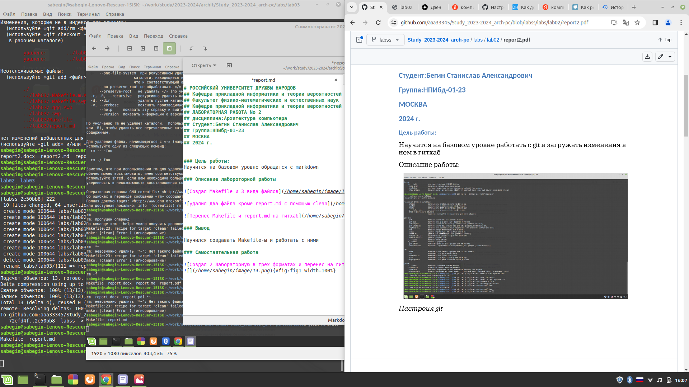

# РОССИЙСКИЙ УНИВЕРСИТЕТ ДРУЖБЫ НАРОДОВ 
## Кафедра прикладной информатики и теории вероятностей
## Факультет физико-математических и естественных наук
## Кафедра прикладной информатики и теории вероятностей
## ЛАБОРАТОРНАЯ РАБОТА No 2
## дисциплина:Архитектура компьютера
## Студент:Бегин Станислав Александрович
## Группа:НПИбд-01-23
## МОСКВА
## 2024 г.

### Цель работы:
Научится на базовом уровне обращатся с markdown
 
### Описание лабороторной работы

{#fig:fig1 width=100%}

{#fig:fig1 width=100%}

{#fig:fig1 width=100%}

### Вывод 

Научился создавать Makefile-ы и работать с ними

### Самостаятельная работа

{#fig:fig1 width=100%}
{#fig:fig1 width=100%}

### Вывод

Попрактиковался в создании .md файлов
