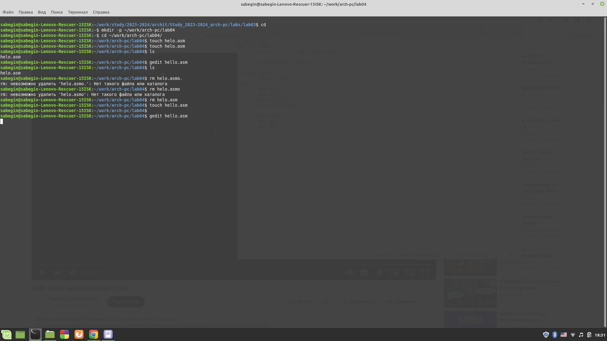
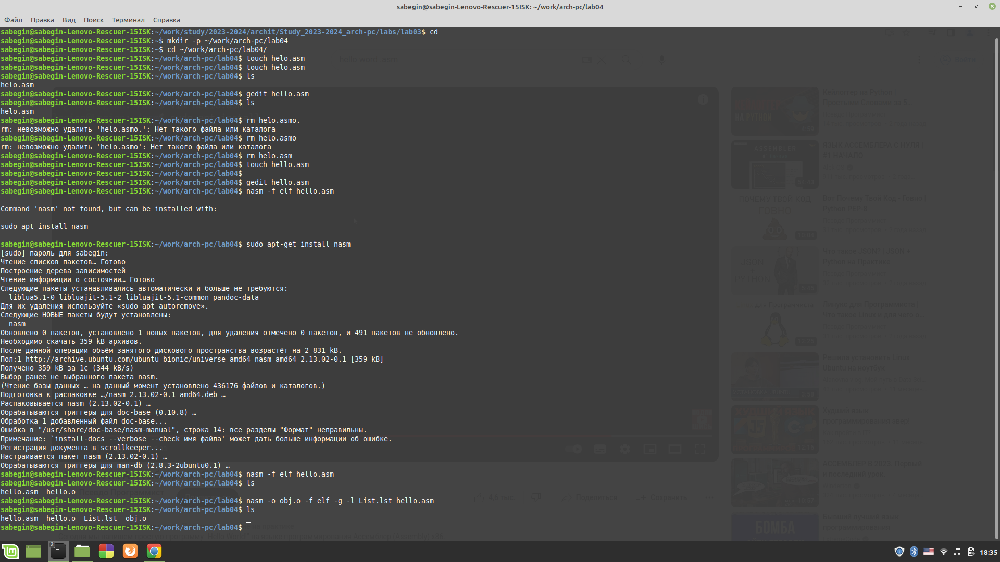
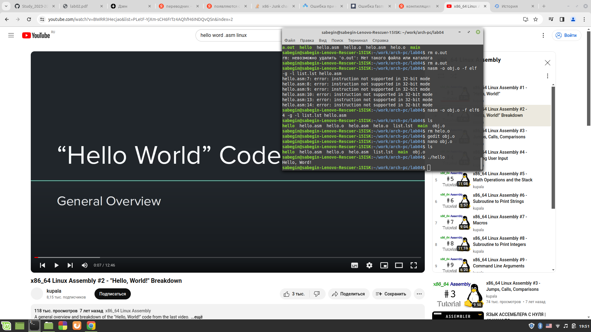
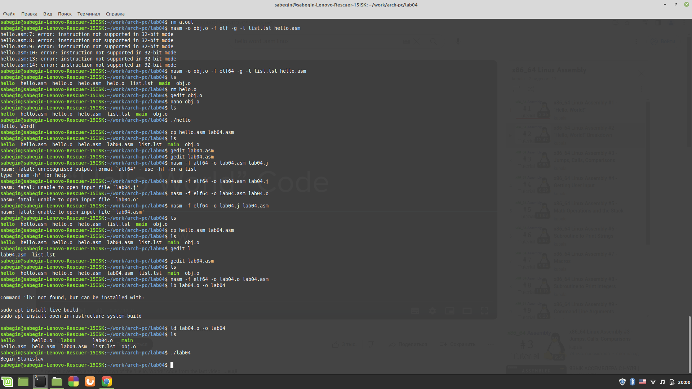
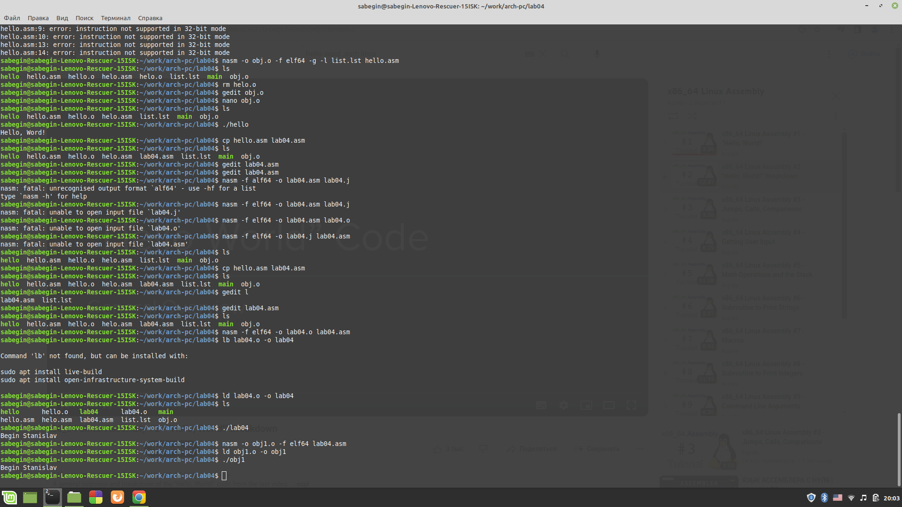
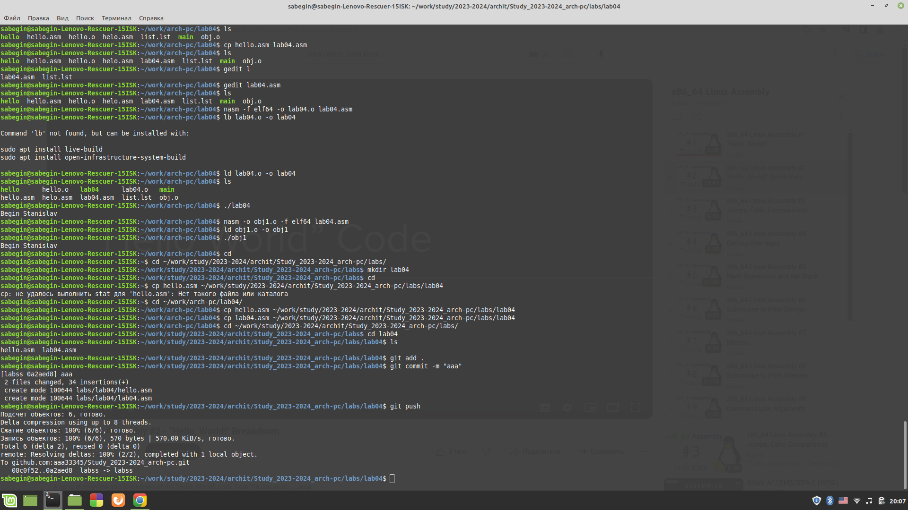

# РОССИЙСКИЙ УНИВЕРСИТЕТ ДРУЖБЫ НАРОДОВ 
## Кафедра прикладной информатики и теории вероятностей
## Факультет физико-математических и естественных наук
## Кафедра прикладной информатики и теории вероятностей
## ЛАБОРАТОРНАЯ РАБОТА No 2
## дисциплина:Архитектура компьютера
## Студент:Бегин Станислав Александрович
## Группа:НПИбд-01-23
## МОСКВА
## 2024 г.

### Цель лабароторной работы:
Научится создфвать и компилировать файлы .asm

### Описание лабороторной работы:
{#fig:fig1 width=100%}

{#fig:fig1 width=100%}

{#fig:fig1 width=100%}

### Вывод:
Научился создавать и компилировать .asm файлы

### Самостоятельная работа 

{#fig:fig1 width=100%}

{#fig:fig1 width=100%}

{#fig:fig1 width=100%}

### Вывод:
Повторил вышепройденный материал

