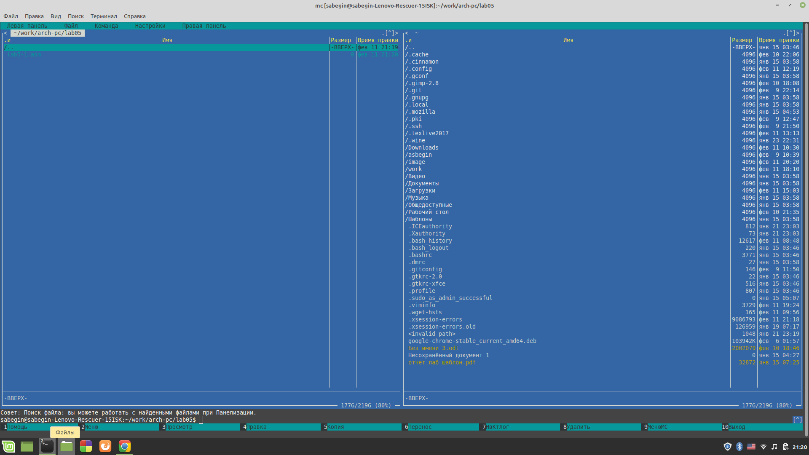
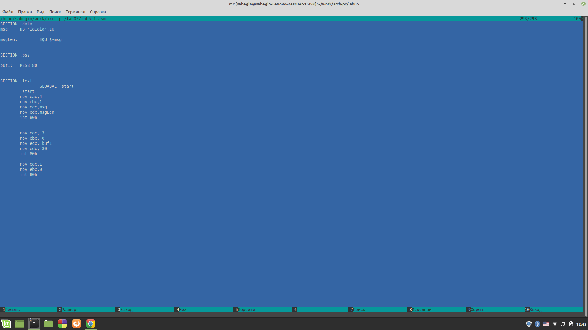
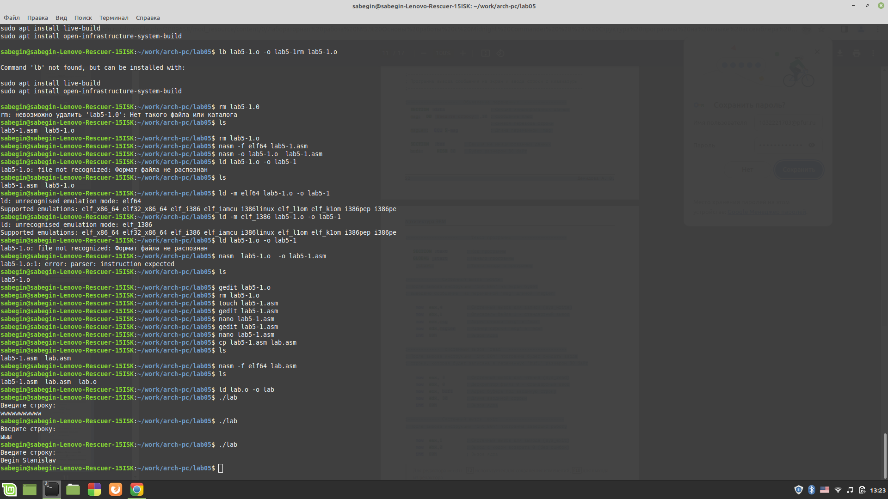
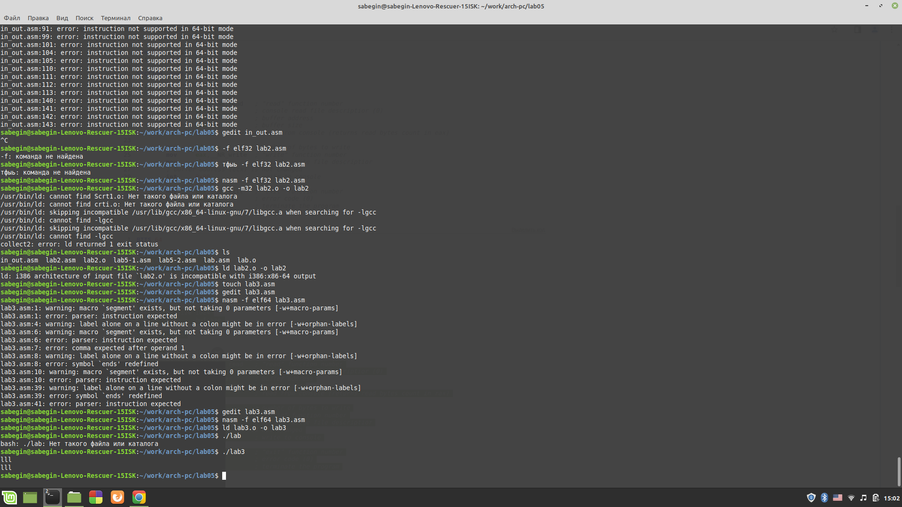

# РОССИЙСКИЙ УНИВЕРСИТЕТ ДРУЖБЫ НАРОДОВ 
## Кафедра прикладной информатики и теории вероятностей
## Факультет физико-математических и естественных наук
## Кафедра прикладной информатики и теории вероятностей
## ЛАБОРАТОРНАЯ РАБОТА No 2
## дисциплина:Архитектура компьютера
## Студент:Бегин Станислав Александрович
## Группа:НПИбд-01-23
## МОСКВА
## 2024 г.

### Цель лабароторной работы:

Научится на базовом уровне пользоваться мс и Использавать внешние файлы

### Описание работы:

{#fig:fig1 width=100%}

{#fig:fig1 width=100%}

{#fig:fig1 width=100%}

### Вывод:

Научился на базовом уровне пользоваться мс, и использовать внешние файлы(пишеш include "", в файле пишеш function: после-функция. В новом файле пишешь call function. файл должен находиться и том же каталоге )

### Лабораторная работа

{#fig:fig1 width=100%}

### Вывод:

Научился вводить текст с консоли и выводить его-же

