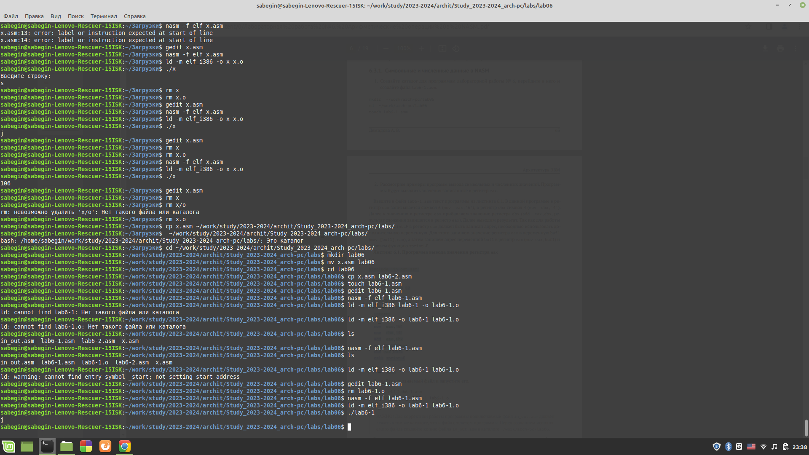
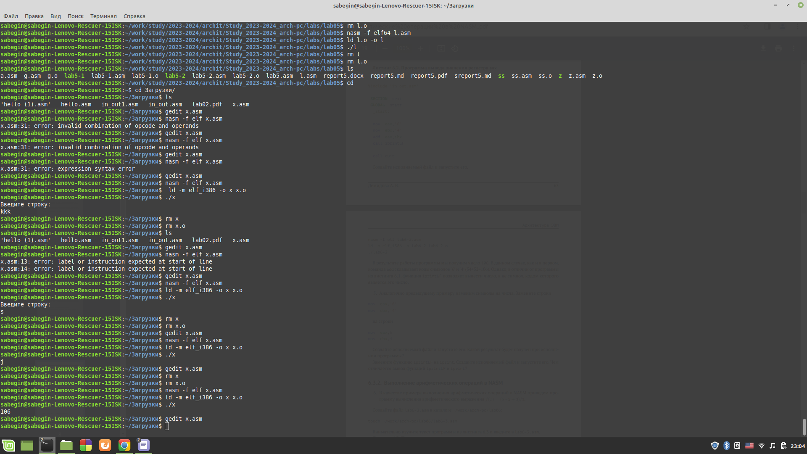
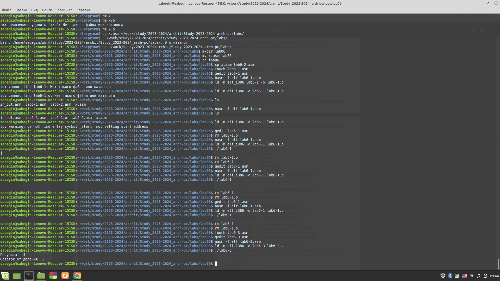
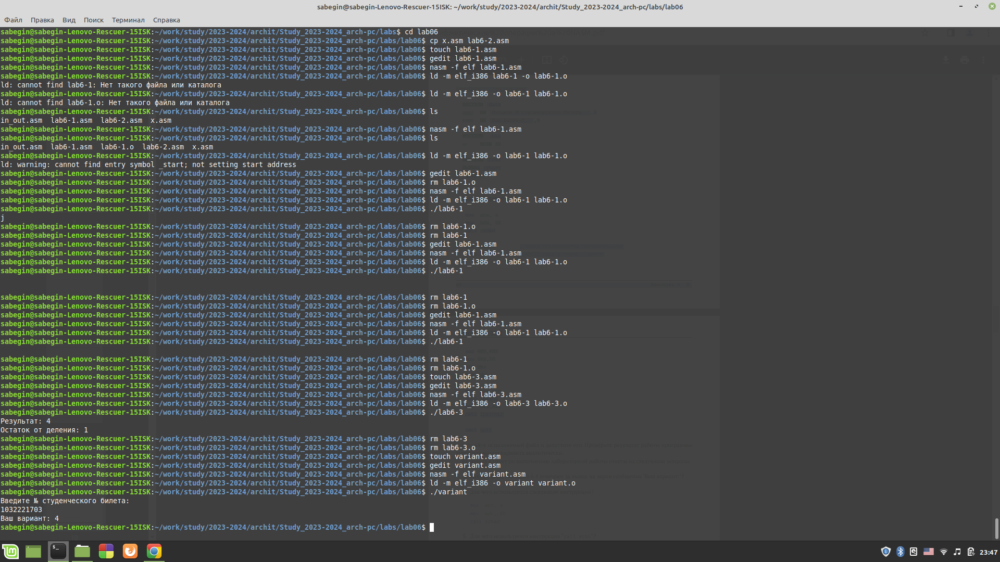
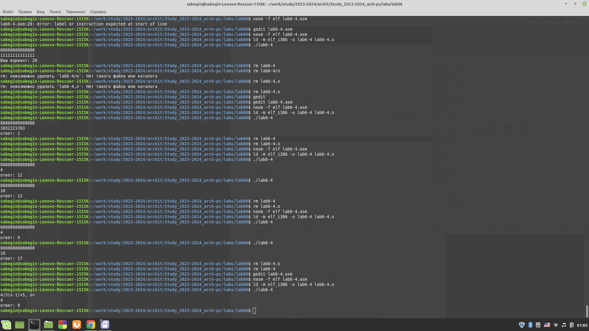

# РОССИЙСКИЙ УНИВЕРСИТЕТ ДРУЖБЫ НАРОДОВ 
## Кафедра прикладной информатики и теории вероятностей
## Факультет физико-математических и естественных наук
## Кафедра прикладной информатики и теории вероятностей
## ЛАБОРАТОРНАЯ РАБОТА No 2
## дисциплина:Архитектура компьютера
## Студент:Бегин Станислав Александрович
## Группа:НПИбд-01-23
## МОСКВА
## 2024 г.

### Цель работы:

Научится считать базавые арифметические выражения на ассемблере х32 nasm

### Описание лабороторной работы:

{#fig:fig1 width=100%}

{#fig:fig1 width=100%}

{#fig:fig1 width=100%}

{#fig:fig1 width=100%}

{#fig:fig1 width=100%}

### Ответы на вопросы:

1. mov eax,rem
  call sprint
2. Для чтения вводимой переменной (без перевода)

3. Для перевода чисел в десятиричную систему

4. mov ebx,20
   div ebx
   inc edx

5. edx 

6. Для прибавления единички

7. mov eax,edx
   call iprintLF

### Вывод:

Научился делать эллементарные арифметические действия и выводить результат

### Самомтоятельная работа:

{#fig:fig1 width=100%}

### Вывод: 

Полнее освоил материал, и повторил его
