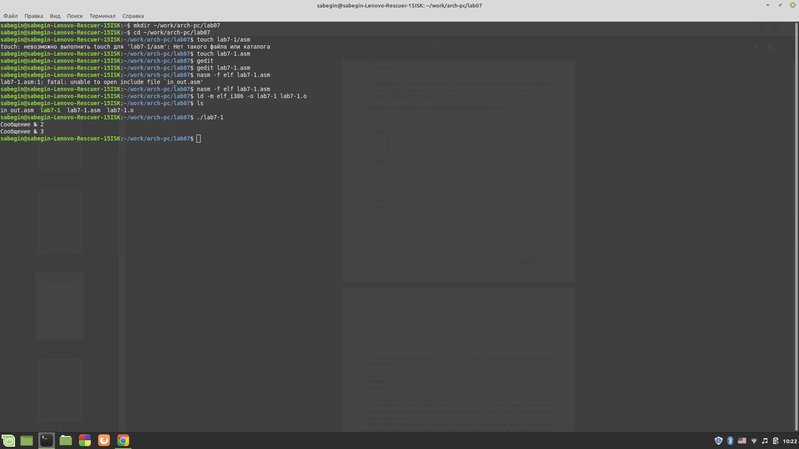
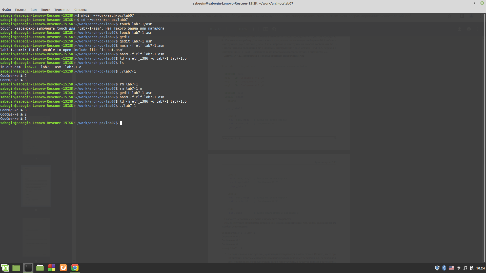
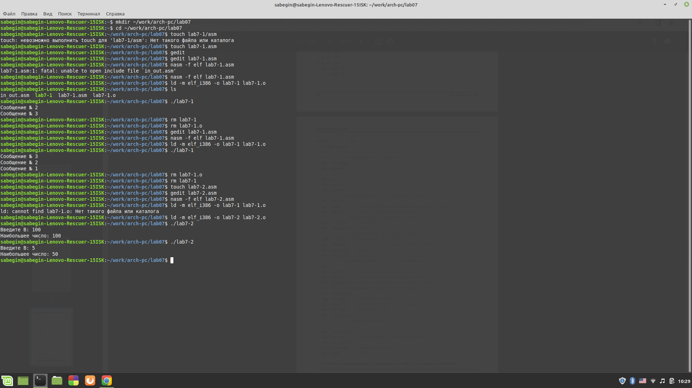
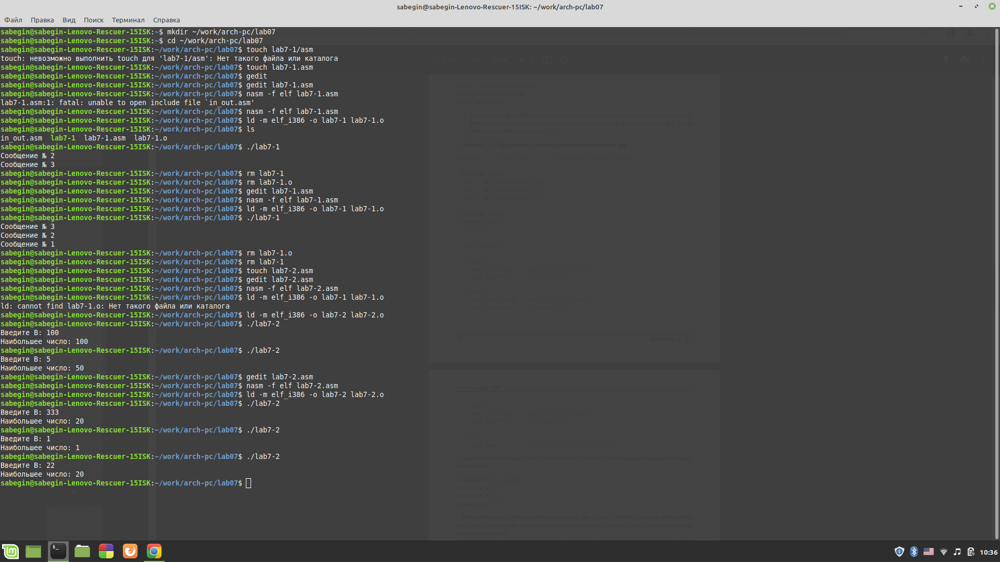
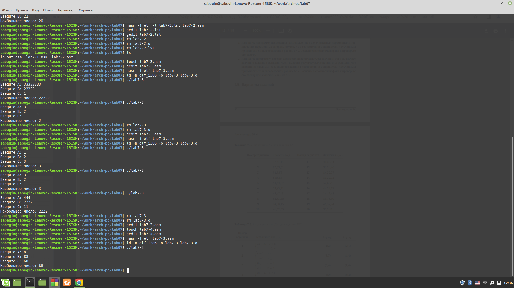
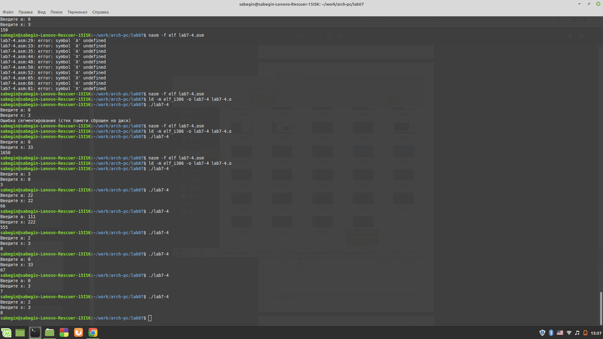

# РОССИЙСКИЙ УНИВЕРСИТЕТ ДРУЖБЫ НАРОДОВ 
## Кафедра прикладной информатики и теории вероятностей
## Факультет физико-математических и естественных наук
## Кафедра прикладной информатики и теории вероятностей
## ЛАБОРАТОРНАЯ РАБОТА No 2
## дисциплина:Архитектура компьютера
## Студент:Бегин Станислав Александрович
## Группа:НПИбд-01-23
## МОСКВА
## 2024 г.

### Цель работы:
научится работать с командами передач и условнымых передач
 
### Описание лабороторной работы:

{#fig:fig1 width=100%}

{#fig:fig1 width=100%}

{#fig:fig1 width=100%}

{#fig:fig1 width=100%}

### Вывод:

Научился использовать команды условного и без условного переход

### Самостаятельная работа

{#fig:fig1 width=100%}

{#fig:fig1 width=100%}

### Вывод:

Более полно освоил материал и повторил его

